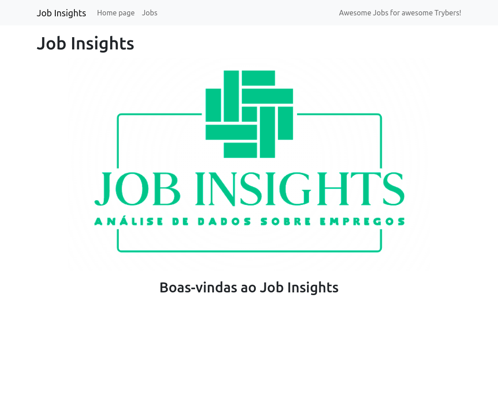
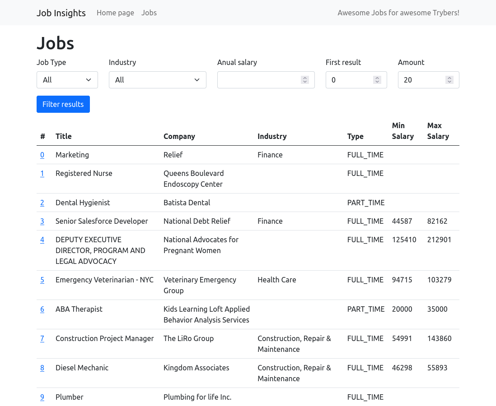
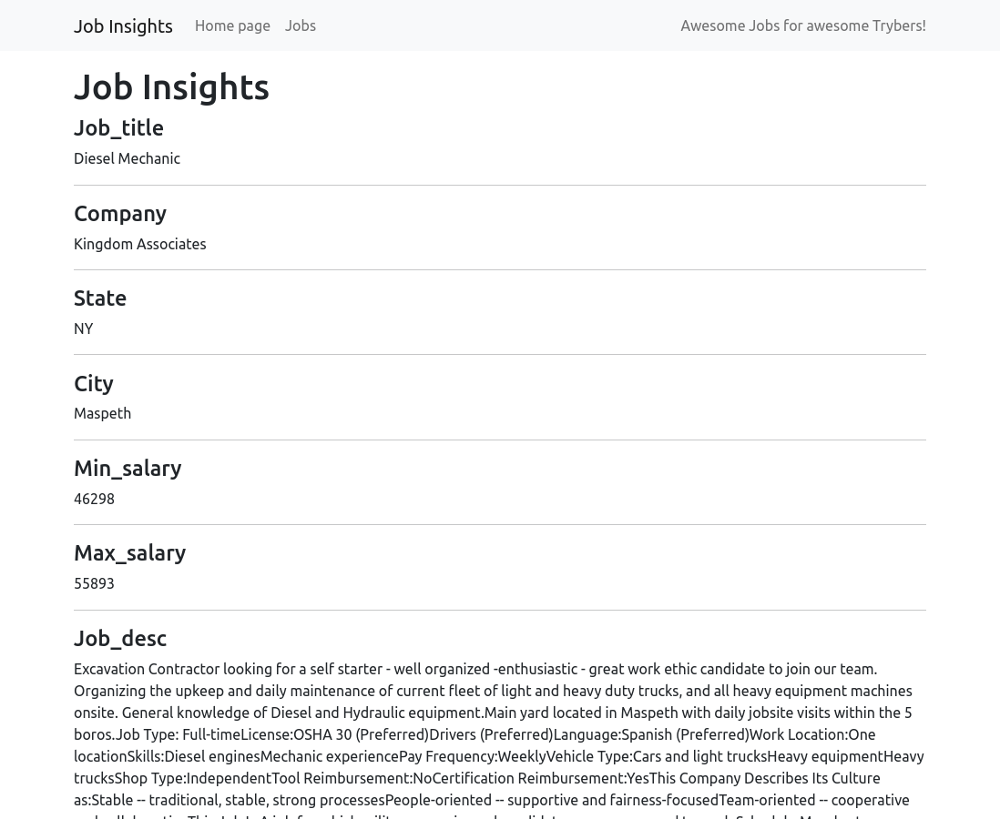

# Sobre

## Seção: `Introdução à Python`

- Foi uma seção introdutória a linguagem python, que busca simplicidade em sua sintaxe, sendo uma das linguagens que mais cresceu e se tornou mais popular devido à área de ciência de dados e é extremamente recomendada quando iniciando na programação, sendo também possível usá-la em criação de aplicações web, automação de tarefas repetitivas, aplicativos desktop, aplicações para dispositivos móveis.

#

  <a href="./screenshots/home.png">
    </img>
  </a>
  <a href="./screenshots/jobs_list.png">
    </img>
  </a>
  <a href="./screenshots/job_detail.png">
    </img>
  </a>

>Amostra do frontend desenvolvido pela trybe
## Projeto: `Job Insights`

- Primeiro projeto do módulo de Ciências da Computação da trybe.
- Foram desenvolvidos métodos usando python pela primeira vez, pois foi uma nova iniciativa de estudo, apontado pelo módulo para aprender mais de uma linguagem, arquivos de minha autoria com final py são de jobs, insights e tests.
- Todo desenvolvimento em flask foi desenvolvido pela trybe, com exceção da rota de "job/<index>", que foi o desafio final do projeto, usar o que ja foi fornecido no projeto para desenvolver uma rota carregando novas informações, que eram dos detalhes do trabalho na listagem.

# Tecnologias e ferramentas usadas 🛠

# Desafios

- Um dos maiores desafios, sem dúvidas, é adaptação para nova sintaxe do python, a troca de convenções usando snake_case e não camelCase em alguns casos, o não uso de colchetes para definir um escopo, atenção reforçada com indentação, pois isso é o que define o pertencimento àquele  contexto.

# Conclusão

- Por apego a sintaxe tive bastante saudades do javascript e do typescript, mas é ótimo sentir na pele, o quão "fácil" fica aprender outra linguagem, a lógica é a mesma, só mudando algumas regras e sintaxes.

  

    <strong>
      :newspaper_roll: Requisitos solicitados durante o desenvolvimento do projeto
    </strong>
  

 
  ### Requisitos
  *Nome* | *Avaliação*
  --- | :---:
  1 - Implemente a função read | :heavy_check_mark:
  2 - Implemente a função get_unique_job_types | :heavy_check_mark:
  3 - Implemente a função get_unique_industries | :heavy_check_mark:
  4 - Implemente a função get_max_salary | :heavy_check_mark:
  5 - Implemente a função get_min_salary | :heavy_check_mark:
  6 - Implemente a função filter_by_job_type | :heavy_check_mark:
  7 - Implemente a função filter_by_industry | :heavy_check_mark:
  8 - Implemente a função matches_salary_range | :heavy_check_mark:
  9 - Implemente a função filter_by_salary_range | :heavy_check_mark:
  10 - Implemente um teste para a função count_ocurrences | :heavy_check_mark:
  11 - Implemente um teste para a função read_brazilian_file | :heavy_check_mark:
  12 - Implemente um teste para a função sort_by | :heavy_check_mark:
  13.1 - Crie a rota /job recebendo o parâmetro index | :heavy_check_mark:
  13.2 - Crie a view job, recebendo o parâmetro index | :heavy_check_mark:
  13.3 - Implemente view job para que ela retorne status code 200 para jobs válidos | :heavy_check_mark:
  13.4 - Implemente view job de forma a retornar o HTML exato de uma página de job | :heavy_check_mark:

#

# Iniciando o Projeto Job Insights.

Importante: seguir a ordem apresentada a baixo, para o funcionamento.

  

    <strong>
      ⚠️ Configurações mínimas para execução do projeto
    </strong>
  

   - Sistema Operacional Distribuição Unix
 - Python versão >= 3.8.10 
 - Docker
 - Docker-compose versão >=1.29.2

  

    <strong>
      ⚠️ Inicie o docker-compose
    </strong>
  

Para ver a aplicação funcionando basta iniciar o docker compose, basta esta na pasta do repositório tendo o requisitos conforme informado na aba de requisitos, e iniciar o docker com `docker-compose up -d`
Após o container "levantar" basta acessar a url: `http://localhost:5000/`

#

  

